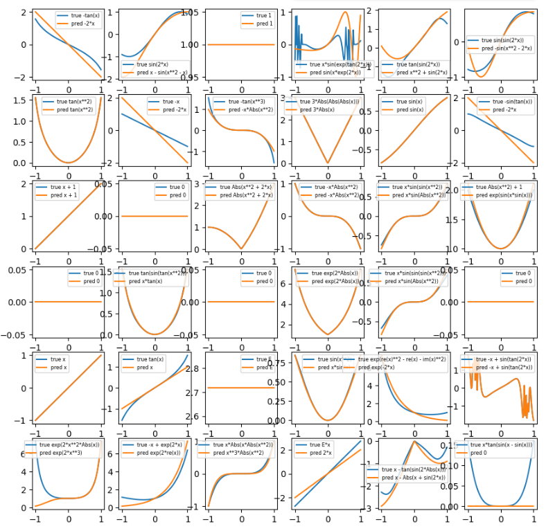

# Symbolic Regression with Deep Neural Networks

This repository contains a Python project for performing symbolic regression using deep neural networks. The goal is to train a model that can discover the underlying mathematical expression from a set of observed data points `(x, f(x))`.

This project is a script-based refactoring of a workshop notebook, inspired by the papers:
- *Deep Learning for Symbolic Mathematics* (Lample and Charton, 2019)
- *End-to-end symbolic regression with transformers* (Kamienny et al., 2022)



## Overview

Unlike standard function fitting, which predicts the *value* of a function, symbolic regression aims to predict the *expression* of the function itself. This project tackles the problem for scalar (1D) functions with a single input variable `x` and integer coefficients.

The pipeline is organized as follows:
1.  **Dataset Generation**: A large dataset of random mathematical expressions is generated, represented as trees.
2.  **Data Filtering**: The dataset is filtered to remove duplicates and numerically unstable expressions.
3.  **Tokenization**: The expression trees are converted into sequences of tokens (integers) that a neural network can process.
4.  **Model Training**: A GRU-based sequence-to-sequence model is trained to perform next-token prediction. Given a set of data points, the model learns to autoregressively generate the token sequence corresponding to the underlying mathematical expression.
5.  **Evaluation & Visualization**: The trained model is evaluated on a test set, and its predictions are plotted against the true functions.

## Project Structure

-   `main.py`: The main entry point to run the entire pipeline.
-   `config.py`: A central file for all hyperparameters and settings.
-   `data_generator.py`: Handles the generation and filtering of the expression dataset.
-   `symbolic_regression_utils.py`: Contains core utilities for tree manipulation, SymPy conversion, and tokenization.
-   `models.py`: Defines the PyTorch neural network architectures (`SeqGRU`).
-   `trainer.py`: Contains the training and evaluation loops for the model.
-   `plotter.py`: Manages all visualization tasks, including plotting final predictions.

## Setup

To run this project, follow these steps:

1.  **Clone the repository:**
    ```bash
    git clone <your-repo-url>
    cd symbolic-regression-dnns
    ```

2.  **Create and activate a virtual environment (recommended):**
    ```bash
    python3 -m venv venv
    source venv/bin/activate
    ```

3.  **Install the required packages:**
    ```bash
    pip install -r requirements.txt
    ```

## Usage

To run the entire pipeline (data generation, training, and evaluation), simply execute the `main.py` script:

```bash
python main.py